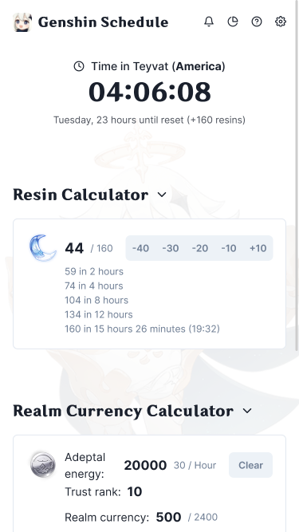

# Genshin Schedule

A simple app for keeping track of your resin in Genshin Impact.

## Features

- Sync data across devices
- Resin notifications through Discord
- Mobile friendly
- Keyboard shortcuts
- Dark mode

## Building from source

This website consists of two subprojects: [web](web) and [sync](sync)

- `web` frontend serving the website assets
- `sync` backend handling API requests

Navigate to the respective subproject directories for detailed build instructions.

You may use the provided Dockerfiles ([web](web/Dockerfile) and [sync](sync/Dockerfile)) to generate production images.
