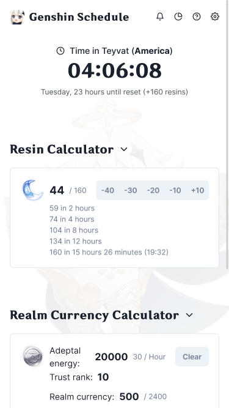

# Genshin Schedule

A simple app for keeping track of your resin in Genshin Impact.

## Features

- Sync data across devices
- Resin notifications through Discord
- Mobile friendly
- Keyboard shortcuts
- Dark mode

## Building from source

This website consists of two subprojects: [web](web) and [sync](sync)

- `web` frontend serving the website, written in TypeScript with Next.js
- `sync` backend handling API requests and Discord notifications, written in C# with ASP.NET Core

Navigate to the respective subproject directories for detailed build instructions.

## Deployment

The provided Dockerfiles ([web](web/Dockerfile) and [sync](sync/Dockerfile)) build production images. Both use the repository root as their build context, which is what [captain-definition-web](captain-definition-web) and [captain-definition-sync](captain-definition-sync) configure for [CapRover](https://caprover.com/).

To build both images locally, run [build.sh](build.sh). It reads build arguments such as `NEXT_PUBLIC_API_PUBLIC` from `.env` if it exists.

| Image  | Port | Notes                                                                                                                         |
| ------ | ---- | ----------------------------------------------------------------------------------------------------------------------------- |
| `web`  | 3000 | See [web environment variables](web/README.md#environment-variables).                                                         |
| `sync` | 80   | Needs PostgreSQL. See [sync configuration](sync/README.md#configuration). Prometheus metrics are served on port 9802. |
